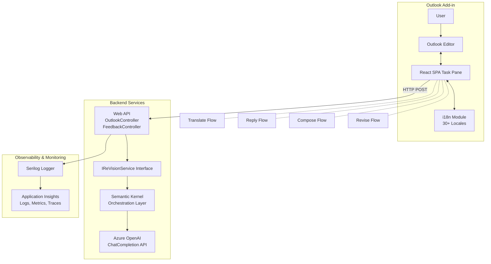

# OutlookReVision - Email Composition Assistant

An Outlook add-in that helps users compose, revise, and translate emails using Azure OpenAI.

## ⚠️ Privacy & Legal Compliance

**IMPORTANT**: This add-in processes user email content through Azure OpenAI. Before deploying to production or submitting to AppSource, you **must** implement user consent and privacy disclosures.

📖 **See**: [Privacy & Consent Requirements](docs/PRIVACY_AND_CONSENT.md) for:
- Required legal documents (Privacy Policy, Terms of Service)
- User consent implementation guide
- GDPR/CCPA compliance checklist
- AppSource certification requirements

**DO NOT deploy without proper consent mechanisms** - Legal non-compliance can result in regulatory fines and AppSource rejection.

---

## Prerequisites

### Backend Requirements

- [.NET 9.0 SDK](https://dotnet.microsoft.com/download/dotnet/9.0)
- Azure OpenAI account with API access
- Azure Application Insights (for logging)

### Frontend Requirements

- [Node.js](https://nodejs.org/) (v20 or later) - **Required by Azure SDK packages**
- npm 10.0.0 or later (comes with Node.js)
- The latest version of Yeoman and the Yeoman generator for Office Add-ins:
  ```bash
  npm install -g yo generator-office
  ```
- Microsoft Outlook (Desktop or Web) with a Microsoft 365 subscription

**Note**: Node 20+ is required due to Azure SDK package dependencies (`@azure/storage-blob`, `@azure/identity`, etc.). Using Node 18 will result in `EBADENGINE` warnings and potential compatibility issues.

## Setup

### 1. Backend Setup

```bash
cd src/api/FunCoding.ReVision.WebApi/FunCoding.ReVision.WebApi
```

Set up your Azure OpenAI configuration:

```bash
dotnet user-secrets set "AzureOpenAIOptions:Model" "your-model-name"
dotnet user-secrets set "AzureOpenAIOptions:Endpoint" "https://your-endpoint.openai.azure.com/"
dotnet user-secrets set "AzureOpenAIOptions:ApiKey" "your-api-key"
dotnet user-secrets set "ApplicationInsights:ConnectionString" "your-connection-string"
```

#### Restore Dependencies

```bash
dotnet restore
```

### 2. Frontend Setup

Navigate to the add-in directory:

```bash
cd src/add-in/OutlookReVision
```

Install dependencies:

```bash
npm install
```

## Available Commands

### Backend Commands

All backend commands should be run from `src/api/FunCoding.ReVision.WebApi/FunCoding.ReVision.WebApi/`:

| Command | Description |
|---------|-------------|
| `dotnet restore` | Restore NuGet packages and dependencies |
| `dotnet build` | Build the project |
| `dotnet run` | Run the API server (starts at `http://localhost:5298`) |
| `dotnet user-secrets list` | List all configured user secrets |
| `dotnet user-secrets set "Key" "Value"` | Set a user secret for local development |

### Frontend Commands

All frontend commands should be run from `src/add-in/OutlookReVision/`:

| Command | Description | Backend Used | Webpack Mode |
|---------|-------------|-------------|--------------|
| `npm install` | Install all dependencies | - | - |
| `npm run dev-server:local` | Start dev server with hot reload | `http://localhost:5298` (local) | Development |
| `npm run dev-server:azure` | Start dev server with hot reload | Azure production API | Development |
| `npm run build` | Build for production (minified, optimized) | Azure production API | Production |
| `npm run build:dev` | Build for development (readable, source maps) | `http://localhost:5298` (local) | Development |
| `npm run validate` | Validate the manifest.json file | - | - |
| `npx office-addin-dev-certs install` | Trust Office development certificates | - | - |

**Understanding the Commands:**

- **`dev-server:local`** - Use for daily development when running both backend and frontend locally. Provides hot reload for fast iteration.
- **`dev-server:azure`** - Use when testing frontend changes against the production API without running the backend locally. Still provides hot reload.
- **`build`** - Creates minified, optimized production files for deployment. Code is compressed and not readable.
- **`build:dev`** - Creates readable development files for debugging. Includes source maps and unminified code.

**Note:** The webpack mode (development/production) controls how the code is bundled (readable vs minified), while the backend URL determines which API the add-in calls. The `dev-server:azure` command uses development mode (for hot reload) while connecting to the production backend.

| Command | Backend Used | When to Use |
|---------|-------------|-------------|
| `npm run dev-server:local` | `http://localhost:5298` | Full local development with both services |
| `npm run dev-server:azure` | Azure production API | Test frontend against deployed backend |
| `npm run build` | Azure production API | Create production deployment files |

### Scenario 1: Debug Both Backend and Frontend Locally

This is the full local development setup where both services run on your machine.

#### Step 1: Start the Backend

In a new terminal:

```bash
cd src/api/FunCoding.ReVision.WebApi/FunCoding.ReVision.WebApi
dotnet run
```

The backend will run at `http://localhost:5298`.

#### Step 2: Start the Frontend

In a new terminal:

```bash
cd src/add-in/OutlookReVision
npm run dev-server:local
```

The add-in will run at `https://localhost:3000` and connect to your local backend at `http://localhost:5298`.

Note that the add-in page is `https://localhost:3000/taskpane.html`.

The add-in detects the runtime environment - if you run it in the browser, it will use the mock mode and skip calling the Outlook APIs.

#### Step 3: Side-load the Add-in

See [Side-loading Instructions](#-side-loading-the-add-in) below.

### Scenario 2: Debug Frontend with Azure Backend

Use this when you want to test your frontend against the production API without running the backend locally.

#### Step 1: Start Dev Server with Azure Backend

```bash
cd src/add-in/OutlookReVision
npm run dev-server:azure
```

The add-in will run at `https://localhost:3000` and connect to the Azure backend at:

```
https://outlook-revision-api-d0dqe4a6ggencehj.australiaeast-01.azurewebsites.net
```

#### Step 2: Side-load the Add-in

See [Side-loading Instructions](#-side-loading-the-add-in) below.

#### Alternative: Build for Production

If you want to create production-ready files (for deployment, not testing):

```bash
npm run build
```

The production build files will be in the `dist` folder with the Azure backend URL hardcoded. These are meant for hosting on a production web server, not for local testing.

## Side-loading the Add-in

### Important: JSON Manifest Format

This add-in uses a **JSON manifest** (`manifest.json`) - the new "Unified manifest for Microsoft 365" format. 

**Critical Limitation:**
- JSON manifests **CANNOT** be manually sideloaded using "Add from File" (neither in Outlook Desktop nor Outlook on the Web)
- JSON manifests **MUST** be sideloaded using automated tooling via `npm start`
- Currently **NOT supported** on Mac

**Why this matters:** The JSON manifest is the future of Office Add-ins, but Microsoft's UI for manual sideloading still only accepts XML manifests. You must use the command-line tooling.

### How to Side-load (Windows Only)

#### Step 1: Close Outlook

Make sure Outlook Desktop is completely closed before sideloading.

#### Step 2: Start the Add-in with Automatic Sideloading

Open a terminal and run:

```bash
cd src/add-in/OutlookReVision
npm start
```

This command will:
1. Trust the development certificates (if first time)
2. Build the add-in
3. Start the dev server at `https://localhost:3000`
4. Automatically register the add-in with Outlook
5. Open Outlook Desktop

**Note:** You may see prompts to:
- Delete old certificates (click Yes)
- Install new certificates (click Yes)
- Trust the WebView (click OK)

#### Step 3: Verify Installation

1. In Outlook, compose a new email
2. Look for the **ReVision** button on the **Home** ribbon
3. Click it to open the add-in task pane

#### Step 4: When Done Testing

**Important:** Always stop the add-in properly to unregister it:

```bash
npm run stop
```

Do NOT just close the terminal or Outlook - this leaves the add-in registered and can cause issues.

---

**Having issues?** See the [Troubleshooting Guide](docs/TROUBLESHOOTING.md) for common sideloading problems.

### For Mac Users

**JSON manifests are not currently supported on Mac.** You would need to convert your manifest to XML format or use Outlook on the Web for testing.

### Option B: Organization Deployment (Admin Only)

If you have admin access to your Microsoft 365 tenant and want to deploy to multiple users:

1. **Create a ZIP package** (required for JSON manifests):
   - Create a folder structure:
     ```
     appPackage/
       ├── manifest.json
       └── assets/
           ├── icon-16.png
           ├── icon-32.png
           ├── icon-64.png
           └── icon-128.png
     ```
   - Zip the contents (not the folder itself) into `appPackage.zip`

2. **Upload to Admin Center**:
   - Go to [Microsoft 365 Admin Center](https://admin.microsoft.com)
   - Navigate to **Settings** → **Integrated apps**
   - Click **Upload custom apps**
   - Upload your `appPackage.zip` file
   - Assign to specific users or entire organization

3. **Users Access**:
   - Users will see the add-in automatically in their Outlook
   - No manual sideloading required

---

## Troubleshooting

Having issues? See the comprehensive [Troubleshooting Guide](docs/TROUBLESHOOTING.md) for solutions to common problems including:

- Backend connection issues
- Frontend SSL certificate errors
- Sideloading problems
- Deployment failures
- Node version compatibility
- And more...

---

## Development Notes

### API Configuration

The API endpoint is configured in `src/add-in/OutlookReVision/webpack.config.js`:

- **Local Backend (default)**: `http://localhost:5298`
- **Azure Backend**: `https://outlook-revision-api-d0dqe4a6ggencehj.australiaeast-01.azurewebsites.net`

**How it works:**
- When you run `npm run dev-server:local` (or just `npm run dev-server`), the `REACT_APP_API_HOST` is not set, so:
  - The frontend uses relative URLs like `/api/Outlook/translate`
  - Webpack-dev-server's **proxy** intercepts these requests and forwards them to `http://localhost:5298`
  - This allows the frontend at `https://localhost:3000` to communicate with the backend at `http://localhost:5298` without CORS issues

- When you run `npm run dev-server:azure`, the `REACT_APP_API_HOST` is set to the Azure URL, so:
  - The webpack proxy is **automatically disabled**
  - The frontend makes direct requests to the full Azure URL
  - Example: `https://outlook-revision-api-d0dqe4a6ggencehj.australiaeast-01.azurewebsites.net/api/Outlook/translate`

**Important**: The environment variable must be set when webpack-dev-server **starts**. If you change the command, you need to stop and restart the dev server.

To change the Azure URL, edit the `dev-server:azure` script in `package.json` or update the default in `webpack.config.js`.

### Logs

**Backend logs** are located in:
- **Local**: `src/api/FunCoding.ReVision.WebApi/FunCoding.ReVision.WebApi/bin/Debug/net9.0/logs/`
- **Azure**: Available in Application Insights and Azure App Service logs

**Frontend logs**: Check browser console (F12)

---

## Known Issues & Fixes

### Line Breaks Disappearing in New Outlook for Windows

**Issue**: When generating content (compose, reply, or revise), line breaks display correctly in the textarea preview but disappear when inserted into the editor in New Outlook for Windows. This does not affect Outlook Classic.

**Root Cause**: 
- **Outlook Classic** uses a text-based editor that properly handles plain text line breaks (`\n`)
- **New Outlook for Windows** (and Outlook on the web) uses an HTML-based editor where plain text line breaks are treated as whitespace and don't render visually
- When inserting text with `Office.CoercionType.Text`, it works in Classic Outlook but fails in New Outlook

**Solution**: 
The add-in now automatically detects the Outlook client type and applies appropriate formatting:
- **For New Outlook/OWA**: Converts `\n` to `<br>` tags, escapes HTML special characters, and uses `Office.CoercionType.Html`
- **For Classic Outlook**: Uses plain text with `Office.CoercionType.Text`

**Implementation**: 
See `RealOutlookService.ts` → `insertText()` method, which includes:
- `isWebBasedOutlook()`: Detects client type using `Office.context.mailbox.diagnostics.hostName`
- `convertTextToHtml()`: Safely converts plain text to HTML format with proper escaping

**Status**: Fixed in version [current] - Automatically handles both Outlook Classic and New Outlook

---

## Production Deployment

Both backend and frontend are deployed automatically via GitHub Actions workflows, which will be triggered automatically:
- **Backend**: `.github/workflows/azure-webapps-dotnet-core.yml`
- **Frontend**: `.github/workflows/azure-staticwebapp.yml`

**Monitor deployments**: Check the [Actions tab](../../actions) in your GitHub repository.

### Deployment Guides

See the comprehensive [Production Deployment Guide](docs/DEPLOYMENTS.md) for detailed instructions on:

- **Backend Deployment**: GitHub Actions workflow to Azure App Service (.NET 9)
- **Frontend Deployment**: GitHub Actions workflow to Azure Static Web Apps (Node 20)
- **Initial Setup**: Configuring secrets and Azure resources
- **Publishing to AppSource**: Step-by-step guide to publish your add-in to the Microsoft marketplace
- **Monitoring & Rollback**: Production monitoring and rollback procedures


---

## Todo

- [ ] Implement user authentication
- [ ] Add unit tests & integration tests
- [ ] Improve error handling

## Additional Resources

- [Office Add-ins Documentation](https://docs.microsoft.com/en-us/office/dev/add-ins/)
- [Outlook Add-ins Overview](https://docs.microsoft.com/en-us/office/dev/add-ins/outlook/)
- [Azure AI Foundry Documentation](https://learn.microsoft.com/en-us/azure/ai-foundry/)

## Support

For issues or questions, please create an issue in the repository.

## Demo Video

[](https://youtu.be/4vLzl5jOKsk)

## Diagram

